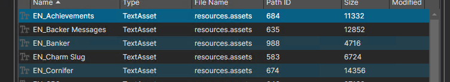
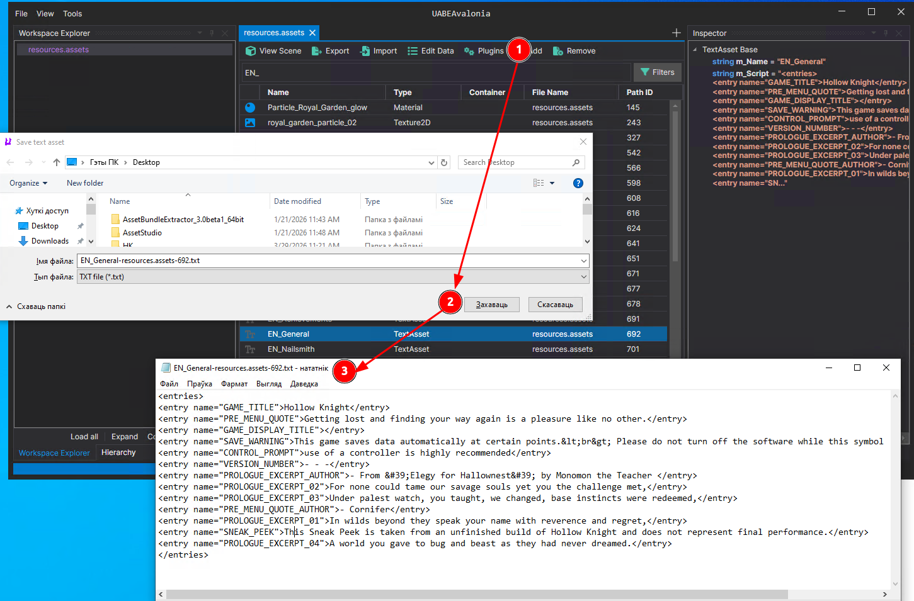

# Дапаможнік па замене тэксту ў праектах на рухавіку Unity

--->[Збор з усімі дапаможнікамі](../readme.md)<---

Дапаможнік не зусім універсальны, таму раю, калі нешта не атрымоўваецца, паспрабаваць штосьці змяняць.

## Дзе знаходзіцца тэкст:

### Варыянт 1. Знаходзіцца ў **resources.assets** у файлах TextAsset-тыпу:

1. Каб экспартаваць тэкст з гульні абярыце патрэбны файл і націсніце кнопку Plugins, затым Export TextAsset, пасля гэтага захавайце файл у патрэбнае месца.

    
2. Рэдагуеце змесціва файла.
3. Каб імпартаваць тэкст у гульню абярыце патрэбны файл і націсніце кнопку Plugins, затым Import TextAsset, пасля гэтага імпартуйце патрэбны вам файл.

