# Дапаможнік па рэдагаванню TextMeshPro-шрыфту ў Unity

--->[Збор з усімі дапаможнікамі](../readme.md)<---

Як рэдагаваць TextMeshPro-шрыфты(далей TMP-шрыфт). 
Дапаможнік не зусім універсальны, таму раю, калі нешта не атрымоўваецца, паспрабаваць штосьці змяняць.

## Структура файлаў
Звычайна TMP-шрыфт знаходзіцца ў файлах **resources.assets** або **sharedassets0.assets** і складаецца з 3-х файлаў:

 - **MonoBehaviour**-файлы захоўваюць інфармацыю аб шрыфце(дакладней аб гліфах), спасылкі на файлы атласу, скрыпта ды матэрыялу. Каардынаты і апісанне гліфаў замацоўваецца якраз у гэтым файле.
 - **Texture2D**-файлы захоўваюць сам атлас шрыфту(дакладней атлас гэта выява, на якой размешчаны ўсе патрэбныя гліфы для пэўнага шрыфту і MonoBehaviour ды  Material файлаў).

    
 - **Material**-файлы захоўваюць патрэбную інфармацыю пра рэндэрынг шрыфту ў гульні, акрамя спасылак на шэйдэры. (рэдагуюцца вельмі рэдка) 

### Для рэдагавання патрабуецца:
0. Паколькі амаль усе праграмы для мадыфікавання Unity-гульняў зробленыя пад АС Windows, не гуляйце ў Linux-героя і выкарыстоўвайце Windows
1. Праграмы для ўзаемадзеяння з файламі гульні:
    | Назва          |  |
    | ------------   | ------- |
    | **UABEA**          | добра працуе з экспартам і імпартам відарысаў + файны фільтр па тыпам ассэтаў  |
    | **UABEANext**      | добрым рэдактар тэкставых ассэтаў     |
    | **AssetStudioGUI** | зручна глядзець змест файлаў гульні    |
    | **AssetRipper**    | можна выкарыстоўваць для экспарту з файлаў гульні |
    
    P.S. *апошнія два апцыянальныя, бо гэты функцыянал ёсць і ў UABEA/UABEANext*

2. Шрыфт (пашыраная версія арыгінальнага, або любы іншы)
3. FontForge (для прагляду і рэдагавання шрыфту)
4. Рухавік Unity і дакументацыя для яго. Каб дазнацца патрэбную версію рухавіка (**UABEA** -> файл **globalgamemanagers** -> Unnamed asset з тыпам **BuildSettings** -> **View Data** -> поле **m_Version**)

## Рэдагаванне
У дадзеным выпадку рухавік быў версіі 2020.2.2f1 і гэта значыць, што нам не трэба ўсталёўваць TextMeshPro.
> З версіі Unity 2018 TextMeshPro ужо ўбудаваны ў рухавік.

1. Перш-наперш усталёўваем Unity патрэбнай версіі.
2. Ствараем пусты праект
3. Дадаём у каранёвы каталог /Assets патрэбныя шрыфты
4. Ствараем TMP-шрыфт: **ПКМ** (па шрыфце) -> **Create** -> **TextMeshPro** -> **Font Asset** (калі далей ёсць яшчэ варыянт, абіраем SDF)

    <!-- 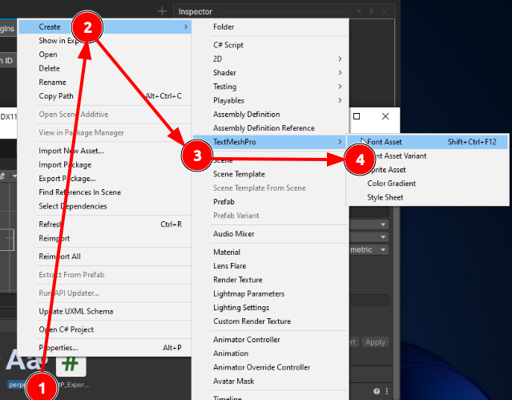 -->
    
5. Абіраем згенераваны TMP-шрыфт і націскаем у акенцы Instector на кнопку **"Update Atlas Texture"**, пасля якога адкрыецца акенца рэдагавання і генерацыі шрыфту.

    |  |  |
    | ----------- | ----------- |
    | 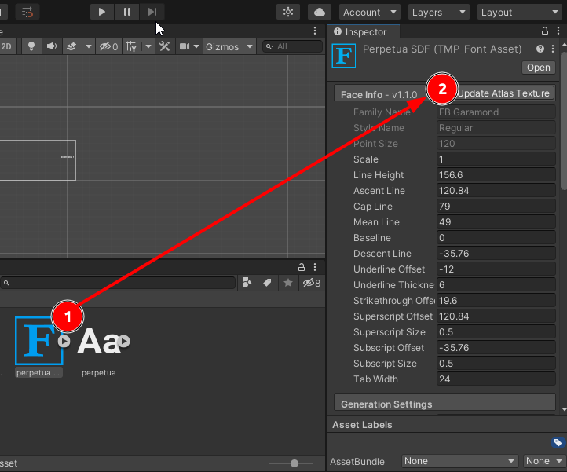 | 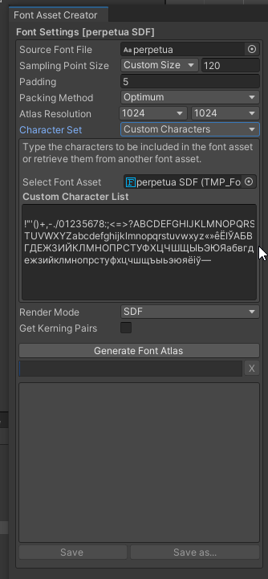 |
    

6. Абіраем параметры генератара	
    - **Sampling Point Size** -> 90 (памер, калі не ўсе сімвалы змяшчаюцца на атласе)
	- **Font Padding** -> 5 (аптымальны варыянт)
	- **Packing Method** -> Optimum
	- **Atlas Resolution** -> 1024х1024  (але можна і павялічыць памер, калі не ўсе сімвалы змяшчаюцца на атласе);
	- **Character Set** - > (Custom Characters)

        Пры генерацыі быў ужыты менавіта такі набор сімвалаў, бо ён складаецца з сімвалаў, што ўжо былі запісаны ў шрыфт + першапачаткова адсутных у ім літар беларускай мовы:
        >&nbsp;!"'()+,-./01235678:;<=>?ABCDEFGHIJKLMNOPQRSTUVWXYZabcdefghijklmnopqrstuvwxyz«»êЁІЎАБВГДЕЖЗИЙКЛМНОПРСТУФХЦЧШЩЫЬЭЮЯабвгдежзийклмнопрстуфхцчшщъыьэюяёіў—

        P.S. дастаць патрэбныя сімвалы можна з MonoBehavior-файла з дапамогай скрыпта **parse_json.py**

	- **Font Render Mode** -> SDF 

	Параметры 1, 2 і 4 можна мяняць у залежнасці ад запоўненасці выявы.
7. Націскаем **Generate Font Atlas** і правяраем, каб усе сімвалы трапілі на выяву

    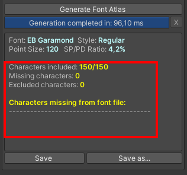

8. Націскаем **Save**. Цяпер у нас ёсць згенераваныя Material і Texture2D атласы
    
    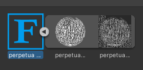
9. Каб пры зборцы правільна перанесліся Material і Texture2D атласы, заходзім зноў у акенца Inspector і гартаем налады да групы "Generation Settings" і выконваем наступныя дзеянні
	- У версіі **6+**:
        - Пераводзім параметр **Atlas Populatuin Mode** на варыянт **Dynamic**
		- Прыбіраем птушку з параметра **Clear Dynamic Data On Build**
		- Прыбіраем птушку з параметра **Get Font Features**
		- Пераводзім параметр **Atlas Populatuin Mode** на варыянт **Static**
        
            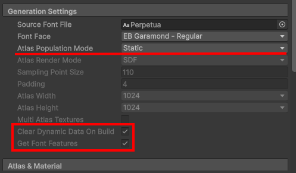
	- У версіі **2020.2.2f1**:
		- Пераводзім параметр **Atlas Populatuin Mode** на варыянт **Static**
        
            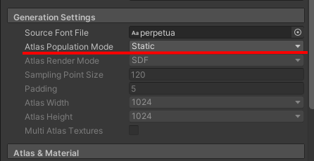
10. Ствараем аб'ект на сцэне: Ціснем **Main Camera** -> **GameObject** -> **UI** -> **Text** -> **TextMeshPro** і абіраем **патрэбны** шрыфт у наладах (каб падчас зборкі ён дадаўся ў рэсурсы)

    |  |  |
    | ----------- | ----------- |
    | [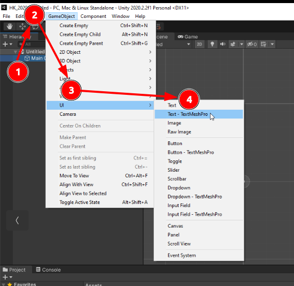](src/image-9.png) | [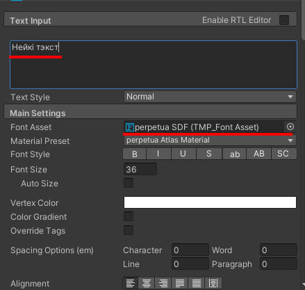](src/image-10.png) |

11. Дадаем у каранёвы каталог /Assets файл TMP_ExportData.cs і з яго дапамогай дастаем патрэбную нам інфармацыю аб TMP-шрыфце. Пасля выкарыстання, інфармацыя будзе экспартавана ў файл **tmp_font_full_export.json**

    [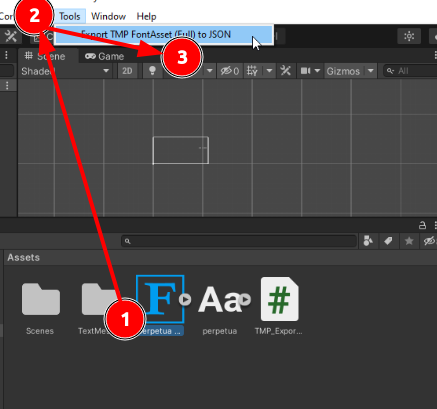](src/image-11.png)
12. Збіраем праект 
13. З дапамогай UABEA дастаём з гульні патрэбны нам MonoBehaviour-файл

    [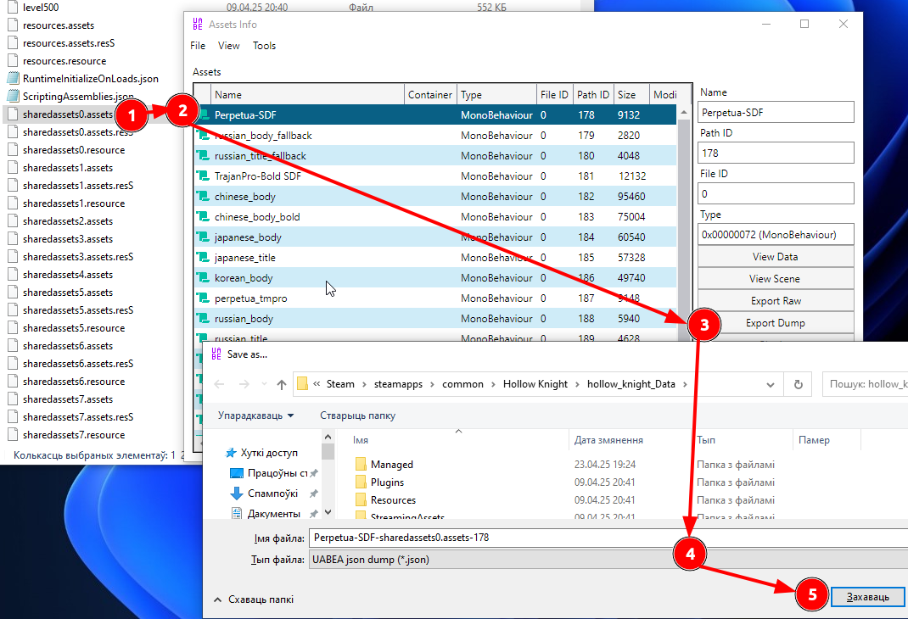](src/image-13.png)
14. Далей з дапамогай тэкставага рэдактара адкрываем файлы з пункта 11 і 13. І капіруем кавалкі з экспартаванага файла ў арыгінальны.
    
    У дадзеным выпадку нас цікавяць: **m_fontInfo** і **m_glyphInfoList**.
    (калі вы выкарыстоўвалі іншы шрыфт, то поле **Name** змяняць не трэба)

    [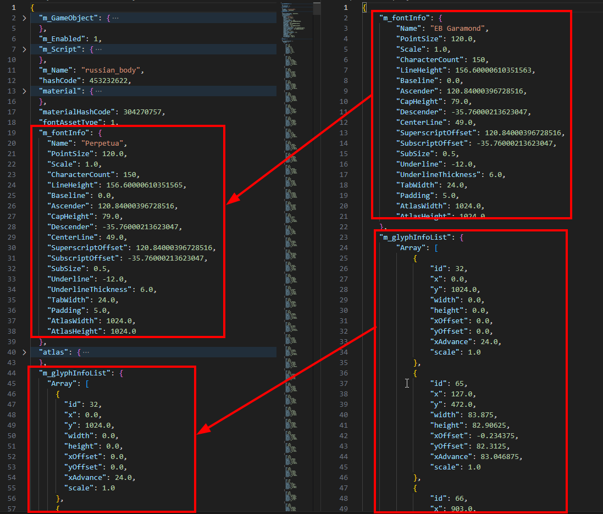](src/image-14.png) 
15. Цяпер праз **Edit Data** у UABEA замяняем арыгінальны змест файла адрэдагаваным. 

    P.S. калі дзесьці не хапае месца на тэкст, то ў **m_fontInfo** можна змяніць поле **scale**, але гэта паўплывае на ўсю астатнюю частку гульні.

    [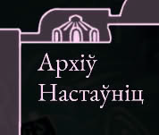](src/image-15.png)
16. З дапамогай UABEA дастаём з сабранага намі праекта Texture2D з назвай шрыфта: **Патрэбны asset** -> **Plugins** -> **Export Texture**
[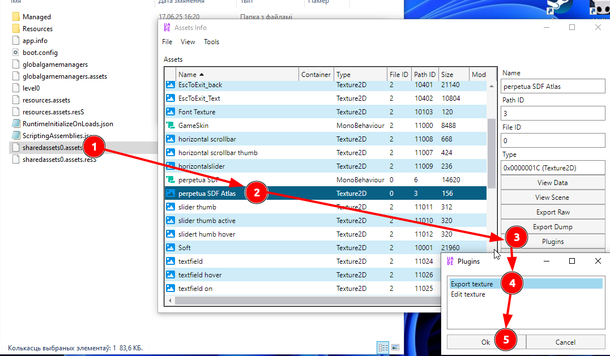](src/image-12.png)

    І імпартуем гэты ассэт у гульнявы файл праз той жа самы плагін, толькі абіраем **Edit texture** -> **Texture** (Load) -> **наш ассэт**
17. Захоўваем.

Дзякуй спадарам art-kandy і Fomka-Wyverno за іх артыкулы і спадару Loki за першасную падтрымку:
- [Іншыя выпадкі рэдагавання](https://steamcommunity.com/sharedfiles/filedetails/?id=3023518241)
- [Пошук патрэбнага ассэта](https://steamcommunity.com/sharedfiles/filedetails/?id=3322671285)