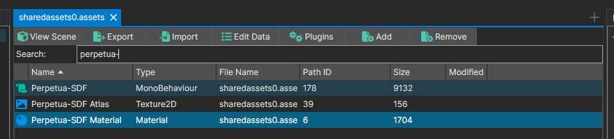
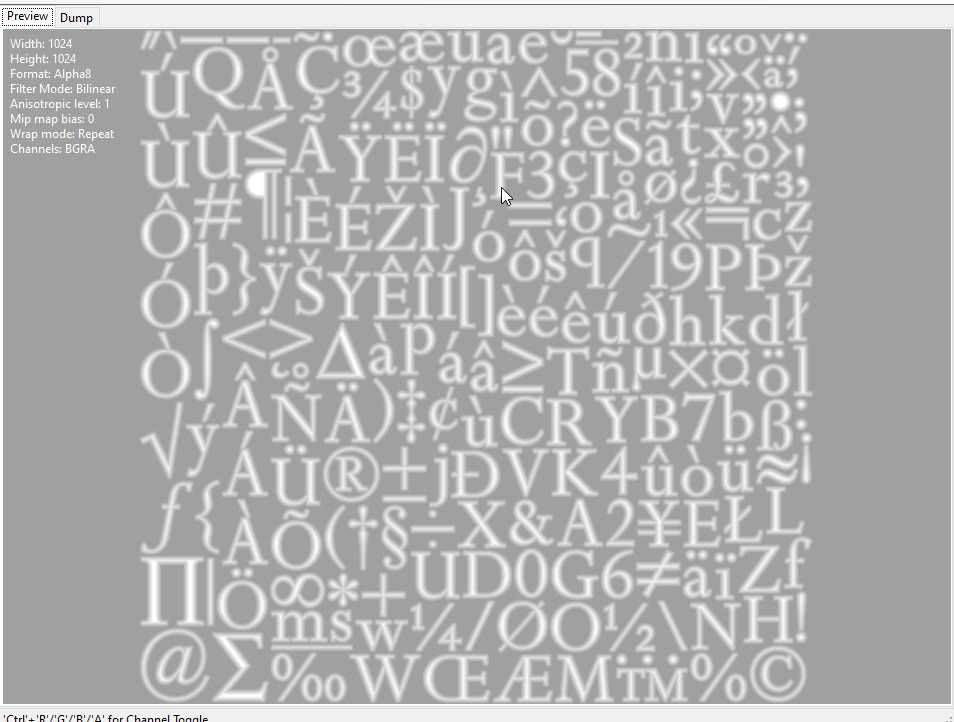
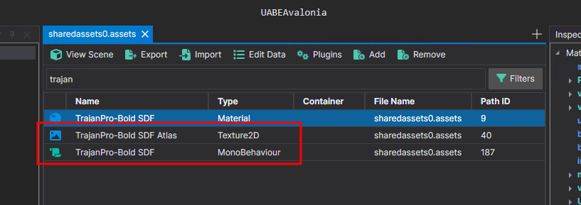
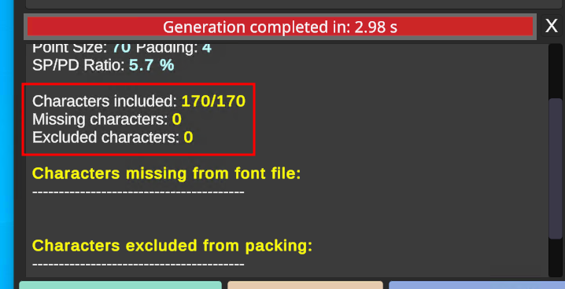
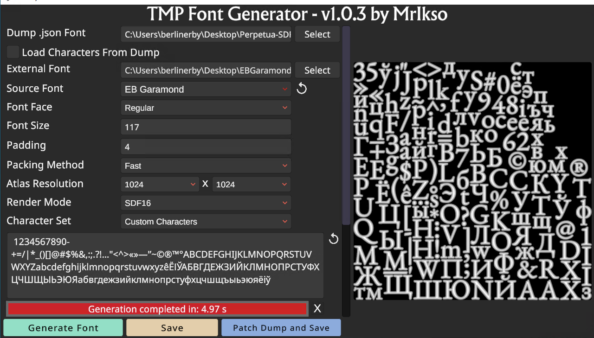

# Дапаможнік па рэдагаванню TextMeshPro-шрыфту ў Unity

--->[Збор з усімі дапаможнікамі](../readme.md)<---

Як рэдагаваць TextMeshPro-шрыфты(далей TMP-шрыфт). 
Дапаможнік не зусім універсальны, таму раю, калі нешта не атрымоўваецца, паспрабаваць штосьці змяняць.

## Структура файлаў
Звычайна TMP-шрыфт знаходзіцца ў файлах **resources.assets** або **sharedassets0.assets** і складаецца з 3-х файлаў:

 - **MonoBehaviour**-файлы захоўваюць інфармацыю аб шрыфце(дакладней аб літарах/знаках), спасылкі на файлы атласу, скрыпта ды матэрыялу. Каардынаты і апісанне літараў/знакаў замацоўваецца якраз у гэтым файле.
 - **Texture2D**-файлы захоўваюць сам атлас шрыфту(дакладней атлас гэта выява, на якой размешчаны ўсе патрэбныя літары/знакі для пэўнага шрыфту і MonoBehaviour ды  Material файлаў).

    
 - **Material**-файлы захоўваюць патрэбную інфармацыю пра рэндэрынг шрыфту ў гульні, акрамя спасылак на шэйдэры. (рэдагуюцца вельмі рэдка) 

### Для рэдагавання патрабуецца:
0. Паколькі амаль усе праграмы для мадыфікавання Unity-гульняў зробленыя пад АС Windows, не гуляйце ў Linux-героя і выкарыстоўвайце Windows.
1. Праграмы для ўзаемадзеяння з файламі гульні:
    | Назва          |  |
    | ------------   | ------- |
    | **UABEA**          | Добра працуе з экспартам і імпартам відарысаў. Файны фільтр па тыпам ассэтаў  |
    | **UABEANext**      | Добры рэдактар тэкставых ассэтаў. Вельмі зручна фільтравацца па назве    |
    | **AssetStudioGUI** | Зручна глядзець змест файлаў гульні    |
    | **AssetRipper**    | Можна выкарыстоўваць для экспарту файлаў з гульні |
    
    P.S. *апошнія два апцыянальныя, бо гэты функцыянал ёсць і ў UABEA/UABEANext*

2. Шрыфт (пашыраная версія арыгінальнага, або любы іншы)
3. Сам файл, дзе знаходзіцца шрыфт.
4. Праграма [TMPUnity](TMPUnity_Release_v1.0.3.zip)

## Падрыхтоўка да рэдагавання

Адкрываем з дапамогай __UABEA__(або іншай праграмы) файл дзе знаходзіцца шрыфт. І экспартуем файлы з тыпамі:     
- `Textrure2D`. Кнопка __Plugins__, затым абіраем __Export Textrure2D/Sprite__. Захоўваем у *__.png__* фармаце.
- `MonoBehavior`. Кнопка __Export__. Захоўваем у *__.json__* фармаце. 

    

## Рэдагаванне арыгінальнага шрыфту

1. Адкрываем TMPUnity і наўпрост перацягваем туды __Шрыфт(.TTF/.OTF)__ і __MonoBehavior(.json)__. Налады для новага шрыфту будуць узяты з зыходных файлаў, але вам ніхто не перашкаджае іх змяніць.

2. У поле з літарамі/знакамі капіруем наступны набор у адпаведнае поле праграмы:
    >&nbsp;1234567890-+=/\|*_()[]@#$%&,:;.?!…"<^>«»—'’~©®™°ABCDEFGHIJKLMNOPQRSTUVWXYZabcdefghijklmnopqrstuvwxyzêЁІЎАБВГДЕЖЗИЙКЛМНОПРСТУФХЦЧШЩЫЬЭЮЯабвгдежзийклмнопрстуфхцчшщъыьэюяёіў

3. Націскаем __Generate Font__.

4. Правяраем ці ўсе літарамі/знакамі запісаліся ў шрыфт. Калі паставіць занадта малы памер відарыса, або занадта вялікі шрыфт, можа адбыцца, што не ўсе літары/знакі будуць уключаны ў выніковыя файлы. 

    

5. Націскаем __Patch Dump and Save__. Пасля гэтага будуць унесены змены ў зыходны MonoBehavior-файл і праграма створыць новы Texture2D-файл.

    

6. Капіруем назву для новага __Texture2D__-файла з арыгінальнага.

>P.S. У выпадку, калі ў вас не атрымалася знайсці шрыфт з неабходнымі вам літарамі/знакамі, вы альбо можаце дамаляваць іх самі, або ўзяць падобны/іншы шрыфт. 

## Запіс рэдагаванага шрыфту ў файл гульні

1. Адкрываем з дапамогай __UABEA__(або іншай праграмы) файл дзе знаходзіцца шрыфт. І імпартуем файлы з тыпамі:     
- `Textrure2D`. Кнопка __Plugins__, затым абіраем __Import Textrure2D__.
- `MonoBehavior`. Кнопка __Import__.

2. Захоўваем вынік праз камбінацыю __Ctrl+S__ або націсні на кнопку __File__, а затым __Save__

### Шрыфт адрэдагаваны

--->[Збор з усімі дапаможнікамі](../readme.md)<---